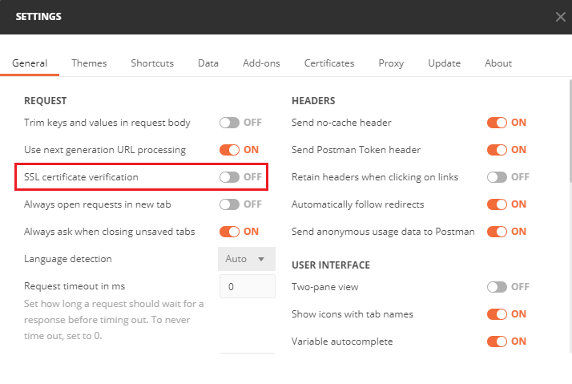
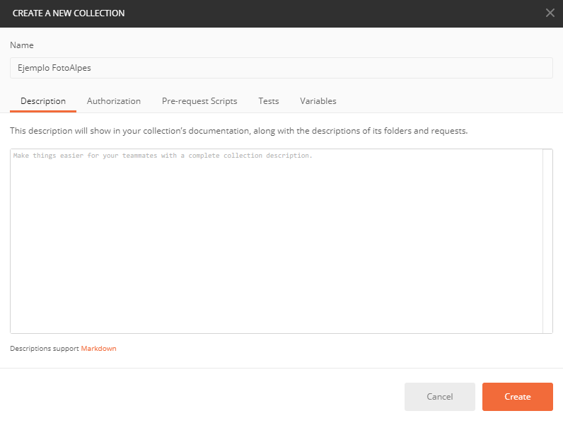
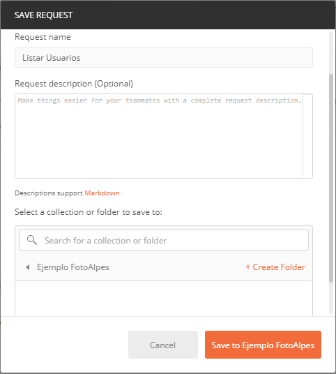
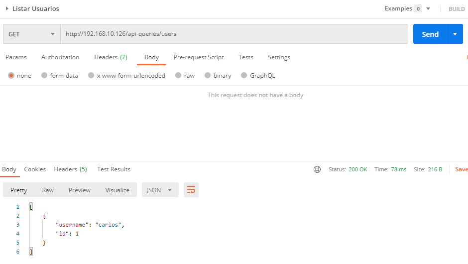
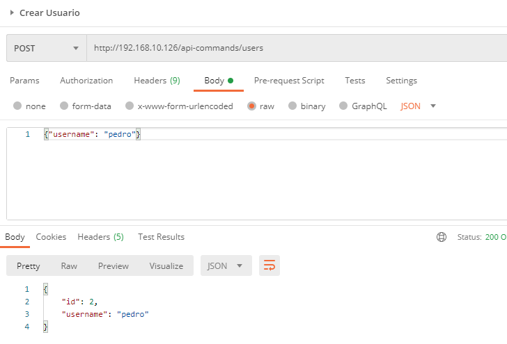
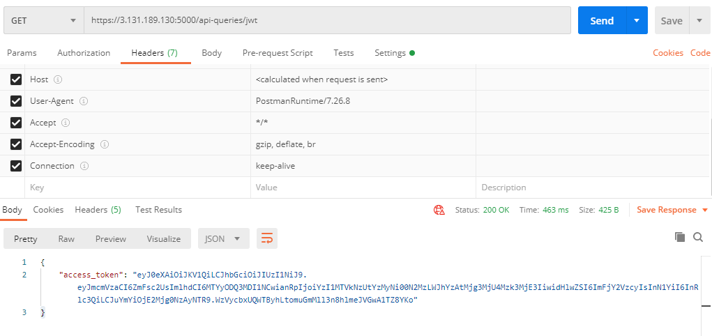
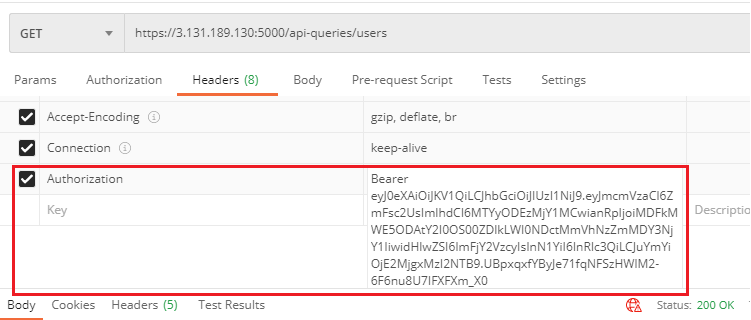

# Pruebas con Postman

Guía para consumir los servicios del ejemplo Foto Alpes desde [Postman](https://www.postman.com/downloads/). El ejemplo no tiene interfaz de usuario, así que se prueba con un cliente REST.

> **Alternativa rápida:** si solo quiere comprobar que todo funciona, no necesita Postman. Ejecute `python3 smoke_test.py`, que recorre el flujo completo automáticamente. Postman es útil cuando quiere explorar los servicios operación por operación.

## La forma rápida: importar la colección

El repositorio incluye **`fotoalpes.postman_collection.json`**, una colección lista con todas las operaciones de esta rama. Importarla le ahorra escribir a mano una decena de URLs y evita los errores de tipeo, que son la causa más común de "no me funciona".

1. Levante los servicios: `docker compose up -d --build --wait`
2. En Postman haga clic en **Import**
3. Arrastre el archivo `fotoalpes.postman_collection.json` o selecciónelo con **Upload Files**
4. Ejecute las peticiones en el orden en que aparecen las carpetas

La colección trae dos comodidades:

- **Los ids se guardan solos.** Al crear un usuario, su id queda en la variable `userId` y las siguientes peticiones lo usan automáticamente. Lo mismo con `productId` y `orderId`. No tiene que copiar nada a mano.
- **El token también** (ramas de seguridad). Ejecute `Obtener token` una vez y las demás peticiones lo envían solas en la cabecera `Authorization`.

Si cambió el puerto o corre los servicios en otra máquina, ajuste la variable `baseUrl` de la colección.

> En las ramas `sync-sec` y `async-sec` **igual debe desactivar la verificación del certificado** en Postman: es un ajuste de la aplicación y no puede venir dentro de la colección. Vea la sección siguiente.

El resto de esta guía explica cómo hacerlo todo a mano, por si prefiere construir las peticiones paso a paso.

## Antes de empezar

Levante los servicios:

```sh
docker compose up -d --build --wait
```

La dirección base depende de la rama:

| Rama | Dirección base |
|---|---|
| `main` | `http://localhost:5000` |
| `sync` | `http://localhost:5000` |
| `sync-sec` | `https://localhost:5000` |
| `async-sec` | `https://localhost:5000` |

## Desactivar la verificación del certificado (solo ramas `sync-sec` y `async-sec`)

Esas ramas usan un certificado autofirmado, así que Postman rechazará la conexión hasta que desactive la verificación:

1. Haga clic en el menú **File → Settings**
2. Se despliega la ventana de configuración
3. Ponga **SSL certificate verification** en **Off**



## Crear una colección y una petición

1. Haga clic en el botón **New**
2. Seleccione la opción **Collection**
3. En el campo **Name** escriba un nombre, por ejemplo `Ejemplo FotoAlpes`, y haga clic en **Create**

   

4. Haga clic de nuevo en **New**
5. Seleccione la opción **Request**
6. En **Request name** escriba un nombre, por ejemplo `listar usuarios`
7. En **Select a collection or folder to save** escriba el nombre de la colección del paso 3 y selecciónela
8. Haga clic en **Save to ...**

   

9. Seleccione el método según la operación: **Get** para consultas, **Post** para creación y **Put** para modificación. El ejemplo no implementa otros métodos.
10. Escriba la URL de la operación. Por ejemplo, para listar usuarios en la rama `main`: `http://localhost:5000/api-queries/users`
11. Haga clic en **Send**
12. En la pestaña **Body** de la respuesta verá lo que retorna el servicio

    

Para las operaciones **Post** y **Put** debe enviar los datos en formato JSON en la pestaña **Body** del request, seleccionando la opción **raw** y el tipo **JSON**:



## Autenticación (solo ramas `sync-sec` y `async-sec`)

En esas ramas **todos los servicios exigen un token JWT**. Sin él responden **401**.

Primero obtenga el token con una petición **Get** al componente `jwt`:

| Rama | URL del token |
|---|---|
| `sync-sec` | `https://localhost:5000/jwt` |
| `async-sec` | `https://localhost:5000/api-queries/jwt` |



Luego, en cada una de las demás peticiones, vaya a la pestaña **Headers** y agregue una cabecera llamada `Authorization` cuyo valor sea la palabra `Bearer`, un espacio y el token obtenido:



## Operaciones por servicio

Reemplace `localhost:5000` por la dirección base de su rama y use `https` en las ramas de seguridad.

### Usuarios

**Ramas `sync` y `sync-sec`:**

| Operación | Método | Ruta |
|---|---|---|
| Listar usuarios | GET | `/users` |
| Crear usuario | POST | `/users` |
| Consultar usuario | GET | `/users/<id-usuario>` |

**Ramas `main` y `async-sec`** (CQRS: comandos y consultas separados):

| Operación | Método | Ruta |
|---|---|---|
| Listar usuarios | GET | `/api-queries/users` |
| Crear usuario | POST | `/api-commands/users` |
| Consultar usuario | GET | `/api-queries/users/<id-usuario>` |

Cuerpo para crear un usuario:

```json
{
    "username": "Nombre del usuario"
}
```

### Productos

**Ramas `sync` y `sync-sec`:**

| Operación | Método | Ruta |
|---|---|---|
| Listar productos | GET | `/products` |
| Crear producto | POST | `/products` |
| Consultar producto | GET | `/products/<id-producto>` |
| Modificar producto | PUT | `/products/<id-producto>` |

**Ramas `main` y `async-sec`:**

| Operación | Método | Ruta |
|---|---|---|
| Listar productos | GET | `/api-queries/products` |
| Crear producto | POST | `/api-commands/products` |
| Consultar producto | GET | `/api-queries/products/<id-producto>` |
| Modificar producto | PUT | `/api-commands/products/<id-producto>` |

Cuerpo para crear o modificar un producto:

```json
{
    "name": "Nombre del producto",
    "description": "Descripción del producto",
    "value": 1500,
    "stock": 100
}
```

### Órdenes

**Ramas `sync` y `sync-sec`:**

| Operación | Método | Ruta |
|---|---|---|
| Listar órdenes | GET | `/orders` |
| Crear orden | POST | `/orders` |
| Consultar orden | GET | `/orders/<id-orden>` |

**Ramas `main` y `async-sec`:**

| Operación | Método | Ruta |
|---|---|---|
| Listar órdenes | GET | `/api-queries/orders` |
| Crear orden | POST | `/api-commands/orders` |
| Consultar orden | GET | `/api-queries/orders/<id-orden>` |

Cuerpo para crear una orden. Los atributos `user` y `product` deben corresponder al id de un usuario y un producto **creados previamente**:

```json
{
    "user": 1,
    "product": 1,
    "quantity": 10
}
```

> La orden se crea en estado `processing` y un worker la procesa. Consúltela unos segundos después para verla en `completed` o `failed`.
>
> En las ramas `main` y `async-sec` el usuario y el producto llegan al servicio de órdenes por **replicación asíncrona**. Si crea la orden inmediatamente después de crear el usuario, puede recibir un 400: espere un momento y reintente.

### Jwt

Solo en las ramas de seguridad. Expone una única operación que **no requiere token**:

| Rama | Operación | Método | Ruta |
|---|---|---|---|
| `sync-sec` | Consultar token | GET | `/jwt` |
| `async-sec` | Consultar token | GET | `/api-queries/jwt` |
